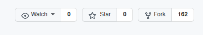
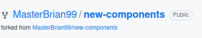
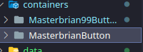
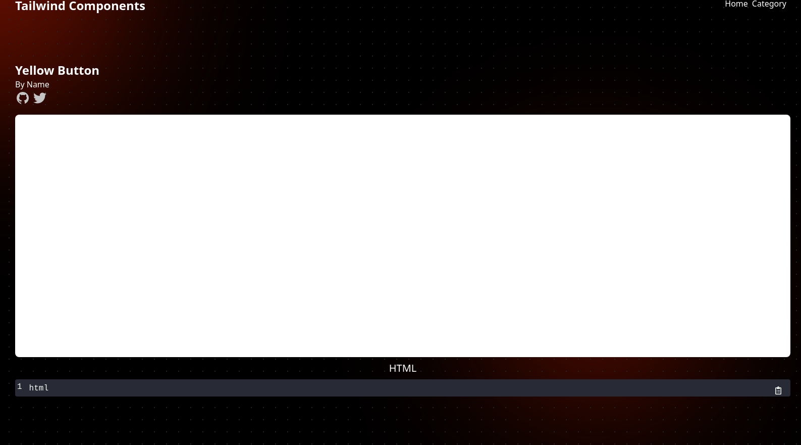
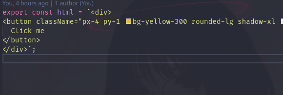
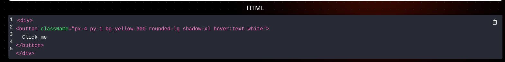

# Contributing

this will guide through the process of contributing to the project.

## Skills you need

- Little bit of knowledge of the React
- That's it

`If you are new to open source or github follow this guide carefully.otherwise you can follow your own rules.. 🙃`

## How to contribute

#### Fork the project



in your github repository,you will find your forked repository.


#### Clone the forked repository and create a new branch

```bash
git clone //github.com/username/project.git
#create a branch
git checkout -b user-username-component-name #masterbrian99-styled-button

```

#### Make sure your are in the right branch

```bash
    git status #this will show you the current branch
```

#### in the project container folder, create a new folder called

- install the dependencies

```bash
npm install
```

#### in the project container folder, create a new folder called `GithubusernameComponentName`

```
    Masterbrian99YellowButton #or something like that
```

- it must be start with a capital letter
- create a unique folder name
  

#### Then create a .tsx file with same folder name

```
    GithubusernameComponentName.tsx
```

#### Copy this code in to the .tsx return statement and import missing components.

```tsx
<div>
  <div className="circle-c circle-c-1"></div>
  <div className="circle-c circle-c-2"></div>
  <div className="max-h-full min-h-screen main-backdrop">
    <div className="container mx-auto">
      <Header /> //import the header component
      <div className="flex flex-col w-full ">
        <UserCard />
        <div className="flex flex-col items-center justify-center flex-1 my-2 text-black bg-white rounded-lg min-h-30">
          //this is where your code goes...
        </div>
        <CodeName
          cardName={"ITEM NAME"} //Make sure to edit these too....
          githubUserName={"USERNAME"}
          twitterUserName={"USERNAME"}
          username={"NAME"}
        />
        <div className="my-2 text-black rounded-lg">
          <CopyBlock
            text={"html"}
            language={"jsx"}
            showLineNumbers={true}
            startingLineNumber={true}
            theme={dracula} //import { CopyBlock, dracula } from "react-code-blocks";
            wrapLines={true}
          />
        </div>
      </div>
    </div>
  </div>
</div>
```

#### create a object in router/paths.ts and import the component you created and the path you want to use.(make sure you are not using the others path)

```ts

{
    path: "/some-random-path",  //this is the path you want to use
    component: Masterbrian99Button, //this is the component you created
  },

```

- ##### now if you start your localhost with `npm start` and you go to the path you created, you will see the component you created.
  it will look like this:
  

#### Now you can start adding your code to the component.

in the white section,you can add your tailwind code.make any components you wants,its all up to you.
you can get reference from other components inside the container folder.

#### After you are done,copy your code and make a new .ts file in the same folder.you can name it however you want.then inside that folder add a new const variable and paste your code.

  

then import the variable in the component you created.and add it to

```tsx
<CopyBlock
  text={extra_file} //here
  language={"jsx"}
  showLineNumbers={true}
  startingLineNumber={true}
  theme={dracula} //import { CopyBlock, dracula } from "react-code-blocks";
  wrapLines={true}
/>
```

if you did everything correctly,you page will look something like this.


### take a screenshot of your component and add it to images/cardImages folder

#### create a another object it data/cards.ts and,add these info

```ts

 {
    username: "userusername",
    image: YellowButtonImage, //imported image
    path: "/yellow-button",  //your url path
    itemName: "Yellow Button", //component name
  },

```

### now if you go to `http://localhost:3000/category`,you can find your card.

#### Finally add your changes to git and make a pull request.

```bash
git add .
git commit -m "Add <your-name> added this component" #change commit massage to meaningful
git push origin <add-your-branch-name>
```

#### Make a pull request
